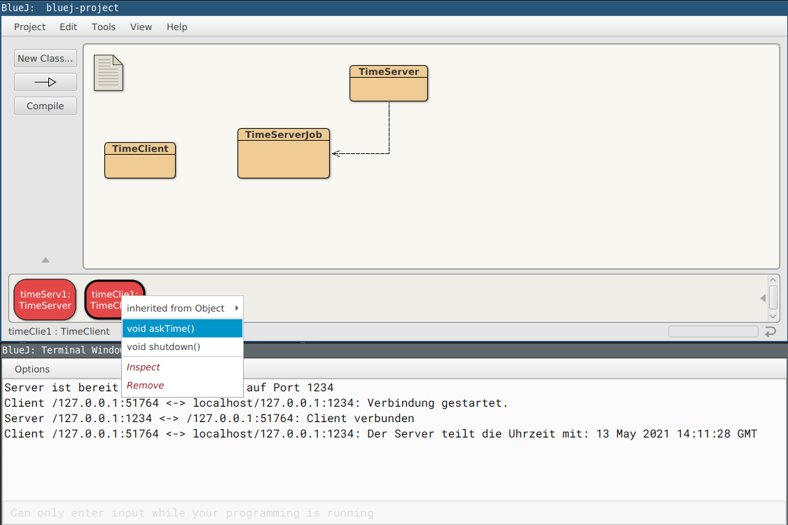

# Einfache Timeserver-Anwendung

Dieses kleine Projekt demonstriert eine simple Server-Client-App, die auf TCP aufbaut. Das Projekt kann als Vorlage für weitere Funktionalitäten dienen. Implementiert ist bisher als Grundfunktionalität das Abfragen der aktuellen Uhrzeit vom Server. Mögliche Erweiterungen sind:
- Eine Abfrage für den aktuellen Wochentag
- Bei der Abfrage soll die Zeitzone mit angegeben werden können. Der Server antwortet dann mit der Uhrzeit für die angegebene Zeitzone.
- Ein Client kann sich als Administrator anmelden. Er muss dafür ein Passwort senden und kann, falls er sich erfolgreich authentifiziert hat, die Uhrzeit manipulieren.

## Verwendung

1) Öffne den Ordner `bluej-project` mit BlueJ.
2) Erzeuge ein neues `TimeServer`-Objekt und gibt den gewünschten Port ein. Dies startet direkt den Server in einem eigenen Thread.
3) Erzeuge ein neues `TimeClient`-Objekt und gib den Port des Servers ein. Eine Verbindung zum Server wird direkt aufgebaut.
4) Erfrage die Uhrzeit mit der `askTime()`-Methode des Clients.

Die Ausgaben werden in der Konsole angezeigt.

## Hinweise

Das Projekt wurde mit Fokus auf die Kommunikation via Sockets erstellt. Es wurde so viel Java-Boilerplate-Code wie möglich vermieden.

## Lizenz

MIT